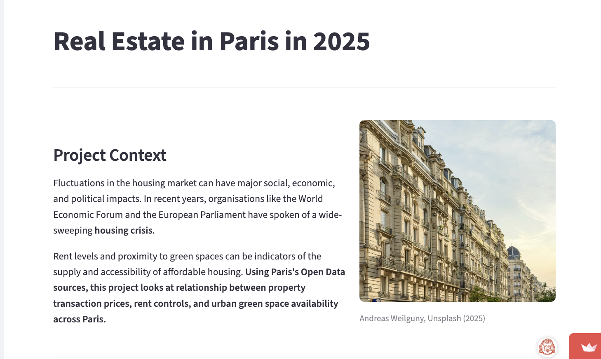
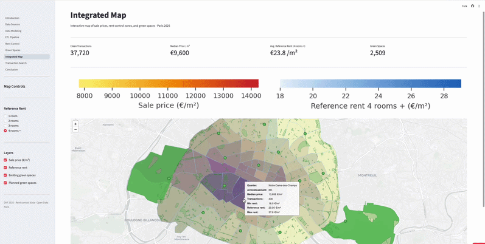
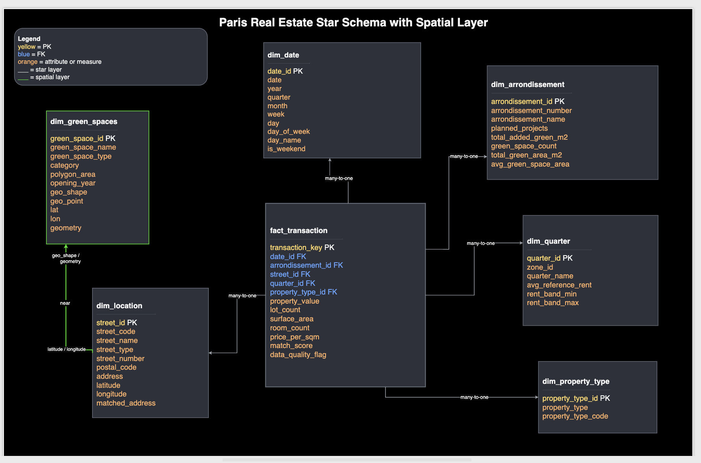
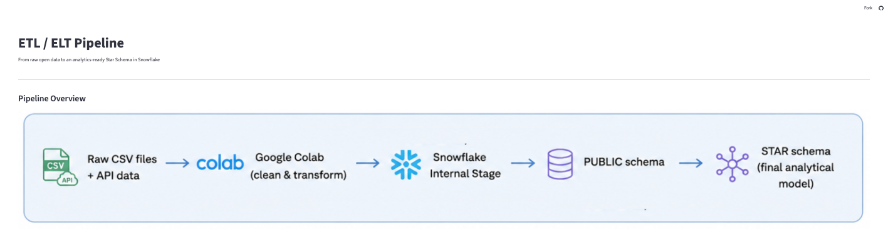

# Paris Real Estate 2025 Project

Analytics Engineering project analysing property values, rent control zones, and urban green spaces in Paris.

**Live dashboard:** https://paris-real-estate-ae.streamlit.app/

**Team:** Stefania Licciardi, Victoria Ford, Andrés Lill

---

## Project Overview

This project integrates four public datasets from the French government and the City of Paris into a unified analytics pipeline, ending in an interactive Streamlit dashboard.

The datasets cover property transactions (DVF 2025), rent control thresholds (encadrement des loyers), existing green spaces, and planned urban greening projects across Paris's 20 arrondissements.

---

## Key Insights

- Central Paris districts combine the highest property prices with elevated rent control thresholds.
- High-value areas tend to show lower transaction volumes, suggesting stronger ownership retention.
- Urban green space availability does not necessarily correlate with premium property prices.

---

## Dashboard Pages

**Home**: Project context, research questions, and live KPIs 
**Data Sources**: Four datasets, scope decisions, and limitations  
**Data Modeling**: From 3NF to Star Schema, ER diagram, and design decisions  
**ETL Pipeline**: Extraction, transformation, Snowflake loading, and SQL populate scripts  
**Analysis**: Interactive Folium map of sale prices, rent control zones, and green spaces


---


## Dashboard Preview

### Home Page

Project introduction and business context for the Paris real estate analytics study.



### Analysis Dashboard

Interactive geospatial dashboard combining property transactions, rent control zones, and urban green spaces across Paris.



### Data Modeling

Star schema design and analytical data modeling used to structure the Paris real estate datasets in Snowflake.




### ETL Pipeline

Overview of the end-to-end analytics engineering workflow from raw datasets to the final analytical model in Snowflake.



----

## Folder Structure

```txt
paris-real-estate-ae/
├── assets/
│   ├── screenshots/
│   ├── paris.jpg
│   ├── map.png
│   ├── pipeline_overview.png
│   ├── implementation_summary.png
│   └── star_schema.png
│
├── data/
│   ├── dvf_paris_2025_aggregated.csv
│   ├── api_rent_control_2025.csv
│   ├── green_spaces.csv
│   └── planned_green_spaces.csv
│
├── pages/
│   ├── 1_Data_Sources.py
│   ├── 2_Data_Modeling.py
│   ├── 3_ETL_Pipeline.py
│   ├── 4_Analysis.py
│   └── 5_Conclusion.py
│
├── sql/
│   ├── load_tables/
│   │   ├── 01_create_stage.sql
│   │   ├── 02_define_file_types.sql
│   │   ├── 03_create_tables.sql
│   │   └── 04_populate_tables.sql
│   │
│   └── star_schema/
│       ├── 01_create_star_schema.sql
│       ├── define_file_types.sql
│       ├── 02_check_tables.sql
│       ├── 03_populate_star_schema.sql
│       └── 04_analysis_queries.sql
│
├── visualizations/
│   └── green_context.py
│
├── Introduction.py
├── data_loader.py
├── README.md
├── requirements.txt
├── .gitignore
└── .gitattributes
```
---

## Data Sources

| Dataset | Source | Rows |
|---|---|---|
| DVF Transactions 2025 | data.gouv.fr | 38,551 |
| Rent Control 2025 | opendata.paris.fr | 320 |
| Existing Green Spaces | opendata.paris.fr | 2,509 |
| Planned Green Spaces | opendata.paris.fr | 71 |

---

## Tech Stack

Python, Pandas, Streamlit, Folium, GeoPandas, Snowflake, SQL

---

## SQL Pipeline

The project includes structured Snowflake SQL scripts organized into two main stages:

- `load_tables/`: staging setup, file formats, raw table creation, and data loading
- `star_schema/`: dimensional modeling, star schema creation, table checks, population scripts, and analytical queries